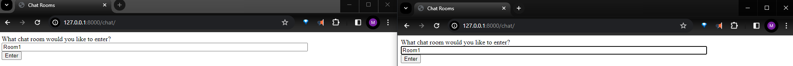
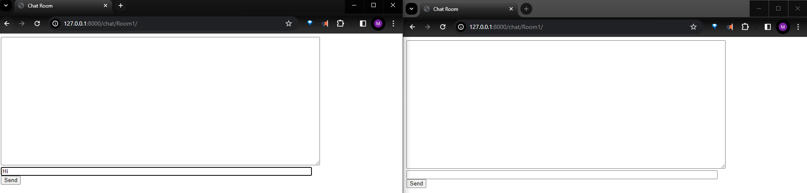
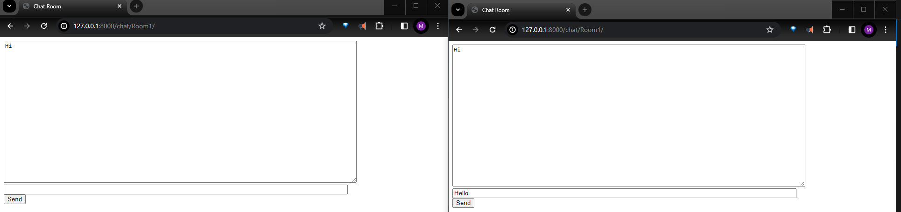
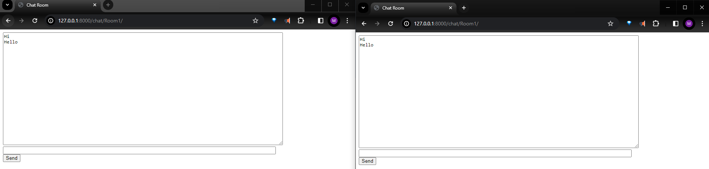

# django-channels
Implement a basic chatting app using django channels. Following [medium article](https://medium.com/atomic-loops/django-channels-is-all-you-need-94628dd6815c). 

## Packages:

## New Terms:
    `python -m pip install -U 'channels[daphne]'`
Daphne is a HTTP and WebSockets protocol server for ASGI to power Django-Channels.

Channels uses something called consumers. These consumers are like friendly assistants that know how to handle different types of real-time communication events, such as receiving a new message in the chat.

`$ python3 manage.py shell
>>> import channels.layers
>>> channel_layer = channels.layers.get_channel_layer()
>>> from asgiref.sync import async_to_sync
>>> async_to_sync(channel_layer.send)('test_channel', {'type': 'hello'})
>>> async_to_sync(channel_layer.receive)('test_channel')`

## Views:
- (Chat Room lobby)[./chat/templates/chat/index.html]

## Files: